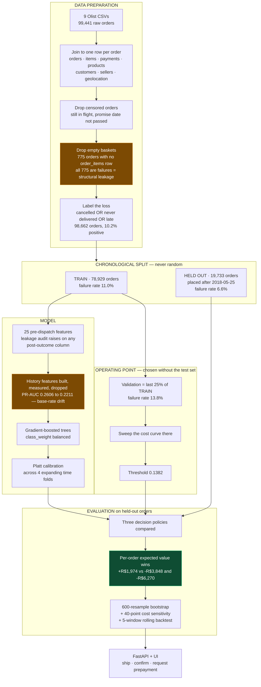
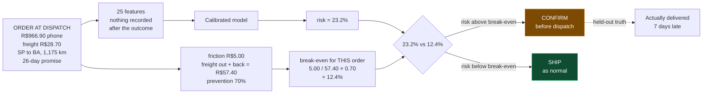

# Pre-dispatch order-failure scorer

**One class of loss: an order that will not be delivered as promised.** Cancelled,
never delivered, or delivered late. Scored *before* the parcel moves, using only
information a merchant holds at that moment, so there is still a decision left to
make — confirm the order, ask for prepayment, or ship it and stop worrying.

This README leads with the numbers, including the ones that are unflattering.

---

# Razorpay AI Builder Buildathon 2026

**Track — AI Risk Manager.** *"Stop the merchant losing money to fraud, returns
and chargebacks."*

> **The brief**
> Build a working **detector, verifier or auto-responder** for **one class of
> loss**, with **measured precision and recall on a held-out test set**.
>
> **Why now**
> AI-enabled fraud is hitting Indian BFSI while returns and chargebacks quietly
> eat margin. This track surfaces the risk and ML minded builders the others
> miss.
>
> **Example directions**
> Chargeback evidence responder · Return-risk scorer · Fraud-spike detector ·
> Abuse-ring sentinel
>
> **The bar**
> **Honest metrics including false-positive cost.** Strictly defence-only:
> anything offense-capable is disqualified.

This project is a **return-risk scorer**, the second of those directions, moved
one step earlier in the timeline: it scores the order *before* dispatch, while
a decision is still possible, rather than after a return is already in motion.

## How this answers the brief, line by line

| The brief asks for | This project | Where to check |
|---|---|---|
| **One class of loss** | One. An order not delivered as promised — cancelled, never delivered, or late. Nothing else is modelled. | [Headline](#headline) |
| **A working detector** | FastAPI service and UI. Runs in two commands after clone; the model and scored test set are committed, so no dataset download and no training step. | [Run it](#run-it) |
| **Measured precision and recall** | **8.1%** precision, **22.2%** recall, each with a 95% bootstrap interval over 600 resamples. | [Headline](#headline) |
| **On a held-out test set** | 19,733 orders placed **after every order the model trained on**. Split by time, never at random — a test asserts the windows do not overlap. | [Method](#method) |
| **Honest metrics including false-positive cost** | **R$16,455**, stated as a headline figure, not a footnote. Plus a 40-point sweep showing how far the assumed friction can be wrong before the conclusion breaks. | [How much survives the assumptions being wrong](#how-much-survives-the-assumptions-being-wrong) |
| **Strictly defence-only** | Nothing offense-capable anywhere. No adversarial tooling, no evasion testing, no LLM, no external service, no credentials. | [Layout](#layout) |

## What is reported that does not flatter it

The bar says *honest*, so these are on the front page rather than omitted:

- An early version showed **precision 1.000**. It was leakage — 775 orders with
  no `order_items` row, all failures, because that table is only written once an
  order is picked. Removing them cut PR-AUC from **0.2591 to 0.1389**. Every
  figure here is post-fix.
- A **one-line rule beats the model at ranking** when both flag equally often
  (−1.3 precision points, 95% CI −2.1 to −0.6 — a real deficit, not noise).
- The **net saving's confidence interval crosses zero** on a single window
  (−R$52 to +R$257). Ranking is solid; the money claim is not yet statistically
  separable from nothing.
- The data is **Brazilian, not Indian**. Real outcomes, real freight, wrong
  geography. The method transfers; the numbers do not.

---

## Run it

The trained model and the scored test set are committed, so it runs immediately
after a clone — no dataset download, no training step.

```bash
git clone https://github.com/waseemGITHUB-CODE/predispatch-order-scorer
cd predispatch-order-scorer
pip install -r requirements.txt

uvicorn predispatch.api:app --app-dir src       # open http://localhost:8000
pytest                                          # 29 tests
```

The UI has two tabs. **Score an order** takes a real held-out order (there are
buttons to load one) and shows the risk, the drivers, the decision, and what
actually happened to it. **Held-out results** is the evaluation: precision,
recall, cost, the baseline comparisons, calibration, sensitivity, confidence
intervals, and the rolling backtest.

<details>
<summary>Rebuilding from the raw data instead</summary>

Every artifact reproduces from the original CSVs. Download the
[Olist dataset](https://www.kaggle.com/datasets/olistbr/brazilian-ecommerce)
(121 MB, free Kaggle account) and unzip the nine CSVs into `data/raw/`, then:

```bash
python -m predispatch.train       # ~2 min  -> artifacts/metrics.json, model.joblib
python -m predispatch.backtest    # ~2 min  -> artifacts/backtest.json
pytest
```

`train` writes every number quoted in this README. `backtest` is separate
because it fits two models per window across five windows.
</details>

---

## How it works

Every box below is a real step in `python -m predispatch.train`. The two drop
boxes in orange are places where data is deliberately thrown away — both were
found by measurement, and both cost the headline number.



### The decision, for one order

A single global threshold assumes every order is worth the same to save. They
are not — the thing being protected is the freight, and freight in this data
varies by more than an order of magnitude. So the cutoff is re-derived per
order.



Change one number — freight R$28.70 to R$2.50 — and the break-even rises to
143%, which no risk can clear. **Same order, same risk, opposite decision.**
That is the whole argument, and it is why the tuned threshold below loses money
while this does not.

## Headline

Measured on **19,733 held-out orders**, placed strictly after every order the
model was trained on. Failure rate in that window: **6.6%**.

| | |
|---|---|
| | Point | 95% CI |
|---|---|---|
| **Precision** | **8.1%** | 7.09 – 9.05% |
| **Recall** | **22.2%** | 19.74 – 24.60% |
| **PR-AUC** | **0.1440** | 0.1324 – 0.1584 *(chance = 0.0658)* |
| **Net saving / 1,000 orders** | **R$ 100** | **−R$ 52 – +R$ 257** |
| **False-positive cost** | **R$ 16,455** | 3,291 good orders flagged |
| Flag rate | 18.1% | 17.58 – 18.71% |
| ROC-AUC | 0.7180 | |
| Brier | 0.0611 | |

Intervals are a percentile bootstrap over 600 resamples of the test set.
**Read the fourth row carefully: the net saving is positive in expectation but
its interval crosses zero.** On a single test window this model's *ranking* is
solidly real — the PR-AUC interval clears chance by a wide margin — while the
*money* is directionally positive and not yet statistically separable from
nothing. Both statements are here because both are true.

Precision of 8.1% sounds bad and mostly is. It is stated first because the
alternative — quoting the 20.4% available at a tighter threshold and not
mentioning that the tighter threshold makes less money — is the kind of thing
this track exists to catch. The decision rule is not chasing precision; it is
chasing money, and those are different objectives.

---

## Against doing something simpler

Four rules a merchant could apply with no model at all, measured on the same
held-out orders.

| | Flag rate | Precision | Recall | False-positive cost | Net saving |
|---|---|---|---|---|---|
| **model** (shipped policy) | 18.1% | **8.1%** | 22.2% | R$ 16,455 | **+R$ 1,974** |
| rule: flag everything | 100% | 6.6% | 100% | R$ 92,170 | −R$ 58,940 |
| rule: cross-state | 59.4% | 4.2% | 38.0% | R$ 56,135 | −R$ 35,503 |
| rule: longest 25% of routes | 25.0% | 5.0% | 19.1% | R$ 23,430 | −R$ 12,208 |
| rule: tightest 25% of promises | 27.9% | 14.9% | 63.3% | R$ 23,410 | −R$ 9,156 |

**Every rule loses money.** Not because they find nothing — the tight-promise
rule has double the model's precision and triple its recall — but because they
flag a quarter to all of the book, and friction on that many good orders costs
more than the failures are worth. This is the whole argument for a cost model
rather than an accuracy score.

### The fair comparison

Flag rate is most of what separates those rows, so here each rule is matched
against the model **at the same flag rate**. That isolates ranking quality from
aggressiveness.

| Rule | Flag rate held equal | Rule precision | Model precision | Lift |
|---|---|---|---|---|
| cross-state | 59.4% | 4.2% | 9.4% | **2.23×** |
| longest 25% of routes | 25.0% | 5.0% | 14.0% | **2.78×** |
| tightest 25% of promises | 27.9% | 14.9% | 13.6% | **0.91×** |

**The model loses to the tight-promise rule at matched flag rate.** Forced to be
equally aggressive, "flag the 25% of orders with the shortest promised delivery
window" ranks orders slightly better than the model does. The model still makes
money and the rule still loses money, because the model does not have to operate
at 27.9% — but the ranking comparison is a loss and is reported as one.

It also has a clear explanation, below.

---

## What the model actually relies on

Permutation importance on the test set, scored by average precision — the
measured drop in held-out performance when a feature is shuffled.

| Feature | Importance |
|---|---|
| `promised_days` | 0.0751 |
| `customer_state` | 0.0084 |
| `seller_state` | 0.0058 |
| `product_volume_cm3` | 0.0035 |
| `handling_days` | 0.0017 |
| *(remaining 20 features)* | ≤ 0.0016 each |

Put that in context: the model scores 0.1440 against 0.0658 for chance, so its
entire edge is 0.0782 — and shuffling `promised_days` alone costs 0.0751 of it.
**Destroy that one feature and the model is barely better than chance.**

So this is, to a first approximation, a promised-delivery-window model with
geography as a minor correction. That is exactly why the tight-promise baseline
is so competitive at matched flag rate: it is a one-feature version of the same
idea. Worth saying plainly rather than leaving buried in an importance chart —
the honest reading is that this dataset carries one strong pre-dispatch signal,
the model finds it, and the other twenty-four features are a thin margin on top.

---

## Four findings that changed the build

### 1. A structural leak that faked a precision of 1.000

The first working version reported **precision 1.000 at threshold 0.5**. It was
entirely an artefact.

775 orders in the raw data have no row in `order_items` — an empty basket — and
**all 775 are labelled failures**, a perfect correlation. The items table is only written when an order
is actually picked and dispatched, so an empty basket is a *consequence* of
cancellation, not a fact known beforehand. The model found it instantly: the 106
orders it flagged at 0.5 were exactly the 106 empty baskets in the test set.

None of those columns are on the banned list, because the leak is not in a
column — it is in a row's *absence*. A ban list only catches the leaks you
already thought of. It was found by noticing that the fifty highest-risk test
orders all had a null price.

Removing them cost the headline dearly, which is the point: **PR-AUC fell from
0.2591 to 0.1389** and the perfect precision vanished. Everything above is the
post-fix number. `data.drop_orders_without_items` and two tests now enforce it,
including a general one that fails if *any* feature's null-ness predicts the
target near-perfectly.

### 2. Seller history features made it worse

Past failure rates by seller, route, category and customer — computed time-safely
with expanding means, so no row sees its own outcome — looked like the obvious
strong features. On a held-out time split they hurt:

| | PR-AUC | ROC-AUC |
|---|---|---|
| without history | **0.2606** | 0.7454 |
| with history | 0.2211 | 0.7161 |

The cause is base-rate drift. Failures fall from **11.0%** in training to **6.6%**
in test, so an expanding mean encodes a worse regime than the one being scored.
A random split would have hidden this entirely. The code is kept in
`features.add_history` with the measurement in its docstring, and is not called.

### 3. A tuned threshold loses money; a per-order rule does not

This is the most useful thing the project found.

The textbook move is to sweep thresholds against the cost model and ship the
best one. Choosing it on validation rather than on the test set (choosing it on
test is peeking, and inflates precision by an amount the reader cannot see), the
threshold that wins is 0.1382 — worth **+R$ 17,454** on the validation window.

Applied to the test set it **loses R$ 3,848**.

The validation window has a **13.8%** failure rate; the test window has **6.6%**.
A probability threshold is fitted to a base rate, and this one did not survive
the shift. Neither did the distribution-relative version:

| Policy | Cutoff | Flag rate | Precision | Recall | Net saving |
|---|---|---|---|---|---|
| **per-order expected value** | per order | 18.1% | 8.1% | 22.2% | **+R$ 1,974** |
| tuned global threshold | 0.1382 | 22.4% | 14.7% | 50.0% | −R$ 3,848 |
| fixed flag rate | 0.1302 | 27.3% | 13.7% | 56.6% | −R$ 6,270 |

The rule that works has no threshold in it at all. Intervening is worth it
exactly when

```
risk × freight × (1 + return multiplier) × prevention rate  >  friction
```

which rearranges to **a different probability cutoff for every order** — low for
a heavy parcel with expensive freight, high for a cheap one. The economics were
always per-order; a single global threshold was the approximation, and it
quietly assumed every order is worth the same to save. Freight in this dataset
varies by more than an order of magnitude, so it is not close.

It needs no tuning, so there is nothing in it to drift. On the test set it beats
not just the tuned threshold but **the best single threshold hindsight could have
picked** (+R$ 1,096 at 0.205).

Two orders, same risk profile, through the live API:

| Freight | Break-even risk | Model's risk | Decision |
|---|---|---|---|
| R$ 41.69 | 8.6% | 16.2% | **confirm before dispatch** |
| R$ 2.50 | 142.9% | 12.9% | **ship as normal** |

### 4. Hyperparameters were noise

A 72-point grid search across four expanding time folds of the training window
moved cross-validated average precision from 0.193 to 0.197, against a
fold-to-fold standard deviation of **0.063**. The entire grid fits inside the
noise of a single fold. The best point is used because it was free. **This model
is signal-limited, not hyperparameter-limited**, and more tuning would buy
nothing.

---

## Method

**Data.** [Olist Brazilian E-Commerce](https://www.kaggle.com/datasets/olistbr/brazilian-ecommerce)
— 98,662 real anonymised orders from 2016–2018, joined across nine tables into
one row per order. Chosen because it is real, has real outcomes, and — critically
— has `freight_value` as an actual column, so the cost of a failure is
**measured** rather than assumed. The alternative direction, a chargeback
evidence responder, was dropped after establishing that no public dataset of
chargeback *outcomes* exists; its metrics would have rested on labels I invented.

**Target.** `cancelled_or_unavailable | never_delivered | delivered_late`, 10.2%
overall. Orders still in flight whose promised date had not yet passed are
dropped as censored rather than labelled either way.

**Split.** Chronological, last 20% held out — 78,929 train, 19,733 test, boundary
2018-05-25. Never random: a random split lets the model learn from orders placed
after the ones it is judged on. A test asserts the windows do not overlap.

**Leakage.** `features.leakage_audit` raises if any post-outcome column (delivery
dates, review scores, `order_status`) reaches the model, and three tests enforce
it — including one that checks the guard itself fires. See finding 1 for the leak
a ban list could not have caught.

**Calibration.** Platt across four expanding time folds. Isotonic was tried and
rejected: it is a step function, its ties collapse distinct scores, and PR-AUC
fell 0.2363 → 0.1793 as an artefact of the calibrator rather than the model.

**Threshold selection.** On the last 25% of the training window, scored by a
model fitted only on what came before it. The test set is used once, to report.

**Cost model.** Measured: failure costs `freight_value × (1 + 1.0)` — out and
back. Assumed: **R$ 5.00** friction per good order flagged, and a **70%**
prevention rate on caught failures. Both assumptions are named in
`CostAssumptions`, echoed into `metrics.json`, and deliberately conservative.

---

## How much survives the assumptions being wrong

Freight is measured. The other two cost inputs are judgement calls, and the
shipped policy is *derived* from them — change the friction and you change both
what gets flagged and what flagging is worth. So the sweep re-derives every
decision at each point rather than re-pricing a fixed set of flags.

| Assumed prevention rate | Profitable while friction is below |
|---|---|
| 30% | R$ 3.50 |
| 50% | R$ 6.00 |
| **70%** *(shipped)* | **R$ 8.50** |
| 90% | R$ 11.00 |

**The headroom on the friction assumption is 1.7×.** R$5 can be wrong by most of
a factor of two before the policy stops paying for itself. Real margin, but not
a large one — and it is the honest answer to "what if your R$5 is wrong?".
72.5% of the 40-point grid is profitable; the losses cluster where friction is
high and prevention low.

A caution about how that number was reached, because the first version was
wrong. Net saving is **not monotonic** in friction: as friction rises the flag
rate collapses — 18% of the book at R$5, 0.4% at R$30 — and past that point the
saving rattles around zero on the luck of whichever handful of orders remain. A
bisection search latched onto one of those late positive flickers and reported
headroom of R$56, eleven times too generous. The reported figure is the **first**
crossing, found by walking a fine grid upward, and a test asserts the policy is
profitable at it and unprofitable one step above.

## Does the model really rank better than the rules?

The matched flag-rate table gives point estimates. Bootstrapping the *difference*
in precision says whether they are real:

| Rule | Precision difference | 95% CI | Verdict |
|---|---|---|---|
| cross-state | +5.2 pts | +4.7 – +5.7 | **model better** |
| longest 25% of routes | +8.9 pts | +8.0 – +10.0 | **model better** |
| tightest 25% of promises | −1.3 pts | −2.1 – −0.6 | **rule better** |

The last interval **excludes zero**. The loss to the tight-promise rule is not
noise — it is a genuine ranking deficit, and this measured it rather than hoping
otherwise. The model still makes money and the rule still loses money, because
the model need not operate at a 27.9% flag rate. But on ranking alone, against
that one rule, it is beaten.

## Does the finding survive at other dates?

The threshold result rests on one boundary, and one boundary is one observation.
So the whole experiment is repeated at five cut points — fit on the past, choose
the threshold on a validation slice inside that past, score the window that
follows. The five test windows are **disjoint**, so they are five observations
rather than one smeared across five.

`python -m predispatch.backtest`

| # | Test window | Failure rate | Per-order | Tuned threshold | Fixed flag rate |
|---|---|---|---|---|---|
| 1 | 2017-12-27 → 2018-02-10 | 8.6% | +665 | -1,126 | -527 |
| 2 | 2018-02-15 → 2018-03-28 | 23.8% | +2,769 | +1,845 | +1,061 |
| 3 | 2018-04-03 → 2018-05-14 | 6.9% | +488 | -1,738 | -810 |
| 4 | 2018-05-17 → 2018-07-10 | 3.8% | -125 | -324 | -705 |
| 5 | 2018-07-18 → 2018-08-29 | 10.0% | +366 | +130 | +116 |

*Net saving per 1,000 orders, R$.*

**The per-order rule beats both threshold policies in 5/5
windows.** The finding is not an artefact of where the knife fell.

Three things worth reading off that table honestly:

- **The per-order rule is profitable in 4/5 windows, not 5/5.**
  In window 4 it loses R$125 per 1,000. That window has the lowest failure rate in
  the study — 3.8% — and when failures are rare enough, no intervention pays for
  itself. The rule still beat both alternatives there; it just beat them into a
  smaller loss.
- **The tuned threshold is profitable in only 2/5**, with a
  median of R$-324. In windows 1 and 3 it flags 73% and 79% of the book — it was
  tuned on a window where failures were common and never adapted.
- **The base rate swings from 3.8% to 23.8%** across these windows. That is the
  instability the whole design is built around, and it is far larger than the
  single 13.8% → 6.6% shift the headline finding was based on.

One consequence for the headline number. The main test window reports R$100 per
1,000 orders; the median across the five backtest windows is
R$488. The main window is simply a hard one — its
6.6% failure rate is near the bottom of the observed range. **The headline is
conservative, not typical**, and it is left as the headline because a number
taken from the toughest window is the safer one to quote.

## Limitations

**This is Brazilian data, not Indian.** Real outcomes, real freight, wrong
geography. The *method* transfers to an Indian merchant book; the numbers do
not. R$ 100 per 1,000 orders is not a claim about anyone's rupees.

**The state names in the UI are relabelled.** The dropdowns read
`(SP) São Paulo — Maharashtra`: the code the model receives, the real Brazilian
state, and the Indian state that plays the nearest role in a delivery network.
The third of those is a **readability aid, not a data claim** — it is matched on
role (São Paulo is 46% of buyers and 70% of sellers, so it is the hub) and not
on any suggestion that failure rates or distances are comparable. Beyond the
twelve largest states, which are 94% of orders, the analogy is loose and exists
only so the list is consistent.

Nothing about it reaches the model. `customer_state` and `seller_state` are
ordinal-encoded with `unknown_value=-1`, so an Indian name posted through would
encode as unknown and collapse both features to a constant — about 18% of the
model's edge over chance. The `<option>` value is always the Brazilian code, the
UI states this beneath the fields, and a test asserts it. See
`src/predispatch/locale.py`.

**The false-positive side is assumed, not measured.** Freight is real. The R$ 5
friction cost and the 70% prevention rate are judgement calls, and the shipped
policy depends on both — it is literally `risk × freight × prevention >
friction`. If friction is really R$ 15, the rule flags far less and saves less.
This is the softest part of the result and no amount of held-out rigour fixes it;
it needs an A/B test against real customers.

**The model over-predicts everywhere.** Every calibration decile shows predicted
risk above observed, by 2 to 6 percentage points. Two causes: `class_weight=
"balanced"` inflates probabilities by construction, and Platt was fitted on
training folds whose base rate was 11.0% against a test window at 6.6%. Ranking
is unaffected, but the absolute probabilities read high — which matters, because
the shipped policy multiplies them by freight.

**Some segments are barely covered.** Recall by customer state runs from 5.0%
(DF) to 41% (cross-state orders). Same-state orders fail more often (10.1% vs
4.2%) yet are flagged far less (7.5% vs 25.4%), because they carry lower freight
and the per-order rule is doing what it was designed to do. Defensible, but it
means the policy systematically under-protects local orders.

**Recall is low.** 22.2% of failures are caught. Three-quarters ship anyway. The
honest framing is that this reduces a loss, it does not solve it.

**Five windows, one dataset, one marketplace.** The rolling backtest covers
2017-12 to 2018-08 — real variation, but all of it Brazilian and all of it from
one company. Nothing here says how the method behaves on a different book.

**The saving varies enormously window to window**: −R$125 to +R$2,769 per 1,000
orders. Quoting any single figure as *the* number would be misleading, which is
why the range and the median are both reported.

**The money claim is the weakest of the three.** Ranking is solid: the PR-AUC
interval sits well clear of chance. The policy comparison is solid: the per-order
rule beats both threshold policies by margins far larger than the noise. The
absolute saving is the one that needs a wider test window or a real A/B test
before anyone should act on the figure.

---

## Layout

```
src/predispatch/
  config.py      paths, split fraction, the leakage ban list, cost constants
  data.py        the nine-table join, the target, the empty-basket filter, time split
  features.py    25 pre-dispatch features, the leakage audit, the rejected history set
  cost.py        cost accounting, the threshold sweep, the per-order expected-value rule
  baselines.py   four no-model rules
  train.py       trains, selects the threshold, evaluates, writes artifacts/
  evaluate.py    matched flag rate, calibration, segments, permutation importance
  actions.py     score -> ship / confirm / prepay, plus per-order attributions
  api.py         POST /score, GET /metrics, GET /examples, and the UI
tests/           20 tests: leakage, split, target, cost model, policy, reported numbers
```

`GET /examples?band=high` serves real orders from the held-out test set with
their true outcomes attached, so the demo scores orders that actually happened
rather than ones invented to flatter it.

Per-order explanations are measured, not asserted: each feature is swapped for
its value in a typical order and the order is rescored, so the reasons shown
cannot contradict the score they appear beneath. All variants are scored in one
batched call.
